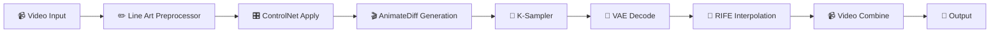

# 🎬 Video to Line Art Animation Workflow

Ein professioneller ComfyUI Workflow für die Konvertierung von Videos/GIFs zu hochwertigen Line Art Animationen.

  

## 🎯 Features

- **🎥 Video Input:** MP4, AVI, MOV, GIF Support
- **✏️ Line Art Extraction:** Saubere ControlNet-basierte Konvertierung
- **🎬 Motion Generation:** AnimateDiff für flüssige Bewegungen
- **🚀 Frame Interpolation:** RIFE für höhere Framerates
- **🎨 Style Control:** Anpassbare Line Art Stile
- **📊 Professional Quality:** Produktionsreife Ergebnisse

## 🔧 Installation

### Automatische Installation:

```bash
# 1. In ComfyUI Verzeichnis navigieren
cd /path/to/ComfyUI-master

# 2. Installation starten
python install_video_lineart_workflow.py
```

### Manuelle Installation:

1. **Custom Nodes installieren:**
```bash
cd custom_nodes
git clone https://github.com/Kosinkadink/ComfyUI-AnimateDiff-Evolved.git
git clone https://github.com/Fannovel16/ComfyUI-Frame-Interpolation.git
git clone https://github.com/cubiq/ComfyUI_IPAdapter_plus.git
git clone https://github.com/Kosinkadink/ComfyUI-VideoHelperSuite.git
git clone https://github.com/Fannovel16/ComfyUI_ControlNet_Aux.git
```

2. **Modelle downloaden:**
   - `control_v11p_sd15_lineart.pth` → `models/controlnet/`
   - `mm_sd_v15_v2.ckpt` → `models/animatediff/`
   - `dreamshaper_8.safetensors` → `models/checkpoints/`

## 🎮 Verwendung

### 1. ComfyUI starten:
```bash
python main.py
```

### 2. Workflow laden:
- Browser öffnen: `http://127.0.0.1:8188`
- **Load** → `workflows/video_to_lineart_workflow.json`

### 3. Video vorbereiten:
- Video in `input/` Verzeichnis platzieren
- **Empfohlen:** 512x512, 10-30 Sekunden, 24 FPS

### 4. Parameter konfigurieren:

#### **Video Input Node:**
- **video:** Pfad zu Ihrem Video (z.B. `input/my_video.mp4`)
- **force_rate:** Frame Rate (0 = automatisch)

#### **Positive Prompt Node:**
```
clean line art drawing, black and white, simple lines, minimal style,
vector art, high contrast, no shading, cartoon style animation,
smooth lines, professional line art
```

#### **K-Sampler Node:**
- **Steps:** 15-25 (höher = bessere Qualität)
- **CFG:** 7.5 (Prompt-Stärke)
- **Scheduler:** euler_ancestral

#### **RIFE Interpolation:**
- **Multiplier:** 2 (verdoppelt Frame Rate)
- **Clear Cache:** 10 (für Speicher-Management)

### 5. Processing starten:
- **Queue Prompt** klicken
- Fortschritt verfolgen
- Output in `output/` prüfen

## 🎨 Style Optionen

### Line Art Stile:

#### **Clean Vector Style:**
```
clean line art, vector graphics, minimal lines, high contrast,
professional illustration, simple shapes
```

#### **Sketch Style:**
```
hand drawn sketch, rough lines, artistic drawing, charcoal style,
loose lines, expressive artwork
```

#### **Anime/Manga Style:**
```
anime line art, manga style, cel animation, clean cartoon lines,
japanese animation style
```

#### **Comic Style:**
```
comic book art, graphic novel style, bold lines, superhero art,
western animation
```

## ⚙️ Erweiterte Konfiguration

### Quality Presets:

#### **🚀 Speed (Draft):**
- Resolution: 512x512
- Steps: 10-15
- Batch Size: 1
- RIFE Multiplier: 2

#### **⚖️ Balanced:**
- Resolution: 512x512
- Steps: 20
- Batch Size: 1
- RIFE Multiplier: 2

#### **🏆 Quality:**
- Resolution: 768x768
- Steps: 25-30
- Batch Size: 1
- RIFE Multiplier: 4

### Video Input Guidelines:

#### **Optimal Input:**
- **Format:** MP4 (H.264)
- **Resolution:** 512x512 bis 1024x1024
- **Duration:** 5-20 Sekunden
- **Frame Rate:** 24-30 FPS
- **Content:** Klare Konturen, gute Beleuchtung

#### **Supported Formats:**
- MP4 ✅
- AVI ✅
- MOV ✅
- GIF ✅
- WebM ⚠️ (experimentell)

## 📊 Hardware Requirements

### **Minimum:**
- **GPU:** NVIDIA GTX 1660 (8GB VRAM)
- **RAM:** 16GB
- **Storage:** 10GB frei
- **OS:** Windows 10/11, Linux, macOS

### **Empfohlen:**
- **GPU:** NVIDIA RTX 3080+ (12GB+ VRAM)
- **RAM:** 32GB
- **Storage:** 50GB frei (für Modelle)
- **SSD:** Für bessere Performance

### **Professional:**
- **GPU:** NVIDIA RTX 4090 (24GB VRAM)
- **RAM:** 64GB
- **Storage:** 100GB+ SSD
- **Multi-GPU:** Für Batch Processing

## 🔍 Troubleshooting

### Häufige Probleme:

#### **CUDA Out of Memory:**
```
RuntimeError: CUDA out of memory
```
**Lösungen:**
- Batch Size auf 1 reduzieren
- Resolution verringern (512x512)
- Steps reduzieren (15-20)
- Andere Programme schließen

#### **Model Not Found:**
```
FileNotFoundError: Model not found
```
**Lösungen:**
- Installation erneut ausführen
- Modelle manuell downloaden
- Pfade in Workflow überprüfen

#### **Schlechte Line Art Qualität:**
**Lösungen:**
- Steps erhöhen (25-30)
- Besseres Input Video verwenden
- ControlNet Strength anpassen
- Prompts optimieren

#### **Langsame Processing:**
**Lösungen:**
- LCM Scheduler verwenden
- Frame Count reduzieren
- Resolution verringern
- xFormers aktivieren

### Performance Optimierung:

#### **Für Geschwindigkeit:**
```python
# K-Sampler Settings
steps = 15
scheduler = "lcm"
cfg = 1.5

# Resolution
width = 512
height = 512
```

#### **Für Qualität:**
```python
# K-Sampler Settings
steps = 30
scheduler = "dpmpp_2m_karras"
cfg = 7.5

# Resolution
width = 768
height = 768
```

## 📁 Projekt Struktur

```
ComfyUI-master/
├── workflows/
│   └── video_to_lineart_workflow.json
├── custom_nodes/
│   ├── ComfyUI-AnimateDiff-Evolved/
│   ├── ComfyUI-Frame-Interpolation/
│   ├── ComfyUI_IPAdapter_plus/
│   ├── ComfyUI-VideoHelperSuite/
│   └── ComfyUI_ControlNet_Aux/
├── models/
│   ├── checkpoints/
│   │   └── dreamshaper_8.safetensors
│   ├── controlnet/
│   │   └── control_v11p_sd15_lineart.pth
│   └── animatediff/
│       └── mm_sd_v15_v2.ckpt
├── input/
│   └── your_videos_here.mp4
├── output/
│   └── line_art_animations/
└── install_video_lineart_workflow.py
```

## 🚀 Workflow Pipeline



## 📋 Workflow Nodes Übersicht

| Node | Funktion | Parameter |
|------|----------|-----------|
| **VHS_LoadVideo** | Video laden | Dateipfad, Frame Rate |
| **LineArtPreprocessor** | Line Art extrahieren | Resolution, Coarse |
| **ControlNetLoader** | ControlNet laden | Model Path |
| **ControlNetApply** | ControlNet anwenden | Strength |
| **CheckpointLoaderSimple** | Base Model | Checkpoint Name |
| **ADE_AnimateDiffLoader** | AnimateDiff laden | Motion Model |
| **CLIPTextEncode** | Prompts kodieren | Text Input |
| **KSampler** | Bild generieren | Steps, CFG, Scheduler |
| **VAEDecode** | Latent → Image | - |
| **RIFE VFI** | Frame Interpolation | Multiplier |
| **VHS_VideoCombine** | Video erstellen | Frame Rate, Format |

## 💡 Pro Tips

### **Input Video Vorbereitung:**
1. **Stabilisierung:** Verwenden Sie stabilisierte Videos
2. **Kontrast:** Hoher Kontrast verbessert Line Art
3. **Länge:** Kurze Clips (5-15s) für beste Ergebnisse
4. **Hintergrund:** Einfacher Hintergrund = bessere Linien

### **Style Optimierung:**
1. **Prompts:** Experimentieren Sie mit verschiedenen Beschreibungen
2. **Negative Prompts:** Unerwünschte Elemente ausschließen
3. **ControlNet Strength:** 0.8-1.2 für Line Art
4. **Steps:** Mehr Steps = konsistentere Qualität

### **Batch Processing:**
```python
# Für mehrere Videos
for video in video_list:
    process_video_to_lineart(video)
```

## 📞 Support & Community

### **Probleme melden:**
- GitHub Issues für Bugs
- Detaillierte Beschreibung + Screenshots
- Hardware-Spezifikationen angeben

### **Community:**
- ComfyUI Discord
- Reddit r/StableDiffusion
- YouTube Tutorials

## 📜 Changelog

### **v1.0 (Current):**
- ✅ Vollständiger Workflow
- ✅ Automatische Installation
- ✅ RIFE Frame Interpolation
- ✅ Multiple Style Presets
- ✅ Comprehensive Documentation

### **Geplante Features:**
- 🔄 Batch Processing
- 🎨 Style Transfer
- 📱 Mobile Support
- 🔧 GUI Wrapper

## 📄 Lizenz

Open Source - MIT License

**Kostenlos für:**
- ✅ Private Nutzung
- ✅ Kommerzielle Projekte
- ✅ Bildung & Forschung
- ✅ Content Creation

---

**Erstellt mit ❤️ für die ComfyUI Community**

🎬 **Happy Line Art Creating!** ✨