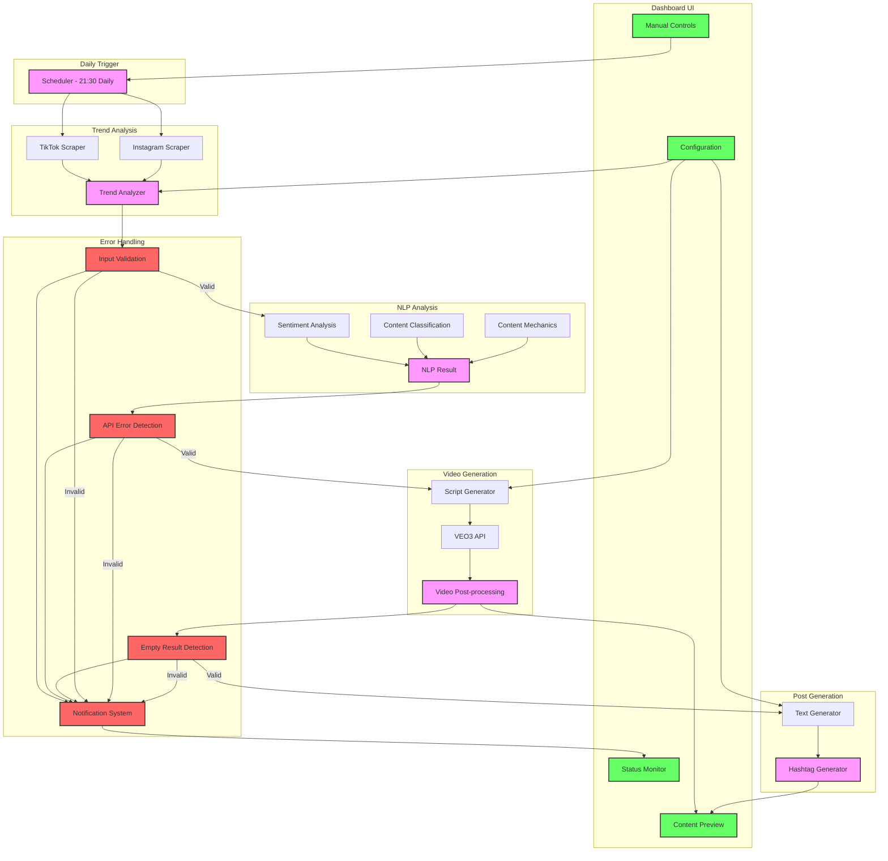

# System Architecture

This document outlines the architecture of the Social Media Video Generation API.

## Architecture Overview

The system is designed as a pipeline with several key components that process data sequentially, with robust error handling at each stage.

## Component Descriptions

### 1. Daily Trigger
- **Scheduler**: Runs daily at 21:30 to initiate the video generation process

### 2. Trend Analysis
- **TikTok Scraper**: Extracts trending content from TikTok
- **Instagram Scraper**: Extracts trending content from Instagram
- **Trend Analyzer**: Processes and ranks trends based on popularity and relevance

### 3. NLP Analysis
- **Sentiment Analysis**: Determines the emotional tone of trends
- **Content Classification**: Categorizes content (educational, entertainment, etc.)
- **Content Mechanics**: Identifies content creation techniques used

### 4. Video Generation
- **Script Generator**: Creates a script based on trend and NLP analysis
- **VEO3 API**: Generates video content using Google's VEO3
- **Video Post-processing**: Finalizes video with effects, captions, etc.

### 5. Post Generation
- **Text Generator**: Creates engaging caption text
- **Hashtag Generator**: Adds relevant hashtags for maximum reach

### 6. Error Handling
- **Input Validation**: Ensures data meets requirements before processing
- **API Error Detection**: Monitors for API failures
- **Empty Result Detection**: Prevents processing with insufficient data
- **Notification System**: Alerts about errors and system status

### 7. Dashboard UI
- **Status Monitor**: Displays real-time system status
- **Content Preview**: Shows generated videos and posts
- **Manual Controls**: Allows manual triggering of processes
- **Configuration**: Settings for all system components

## Data Flow

1. The scheduler triggers the pipeline daily at 21:30
2. Trend analysis collects and ranks current social media trends
3. If valid trends are found, NLP analysis classifies and analyzes the content
4. Based on NLP results, a video script is generated and passed to VEO3
5. The generated video is post-processed with captions, effects, etc.
6. Post text and hashtags are generated to accompany the video
7. The final content is available in the dashboard for review
8. At any point, if an error occurs or data is invalid, the process stops and notifies the user

## Error Handling Philosophy

The system follows a strict "fail fast" approach:
- No processing continues with invalid or empty data
- No fake content is generated when sources are unavailable
- All errors are clearly communicated through the dashboard
- Manual intervention is required when automatic processing fails